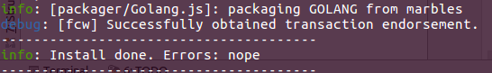
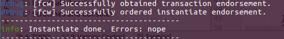

## 1. 安装区块链票据依赖项
进入区块链票据目录
```
cd BillsOnBC
```
安装依赖项：
```
npm install
```
安装过程未出现任何error说明安装成功
## 2. 获得加密证书材料
**关键步骤**打开配置文件`<BillsOnBC root>/config/connection_profile_local.json`
- `organizations -> x-adminCert -> path`
- `organizations -> x-adminKeyStore -> path`

将以上`path`修改为对应的fabric-sample/basic-network中的加密材料，主要修改前置根目录到正确位置。
- `client -> credentialStore -> path`

client的path由于fabric-client的bug，直接修改为`/root/.hfc-key-store`
修改完成以后，可以进行链码安装工作。
## 3. 安装和实例化链码
进入以下目录：
```
cd BillsOnBC/scripts
```
安装链码：
```
node install_chaincode.js
```
看到以下安装信息说明链码安装成功：


实例化链码
```
node instantiate_chaincode.js
```
看到一下实例化信息说吗链码实例化成功：

