## 1.登录
- 如果你选择本地搭建网络，[登录本地页面](localhost:3002/login)
- 如果你选择在线调试网络，[在线登录页面](http://47.100.238.193:3002/login)
进入登录界面，会看到如下界面：

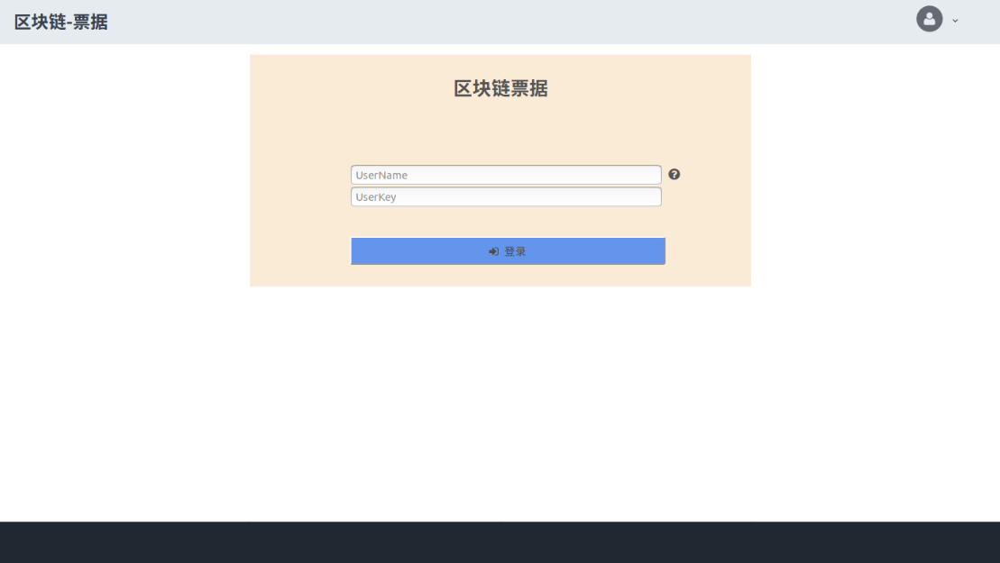

鼠标放置在 :question: 标志会提示目前系统的可登录账户：
```
The account name in the system: alice,jack,tom,mike,fei
```
每一个账户都会有一个唯一的证件号作为标识，该证件号以"CIM"开头

| 账户名称 | 账户证件号 |
| ------- | -----| 
| alice | CIM001019910510897 |
| jack | CIM000001079997106 |
| tom | CIM000000109111116 |
| mike | CIM000101107105109 |
| fei | CIM000000105101102 |

现在我们可以输入
```
UserName： alice
UserKey: 456789
```
密码统一都为“456789”
## 2. 主界面
输入正确的用户名和密码以后，就进入了主界面：

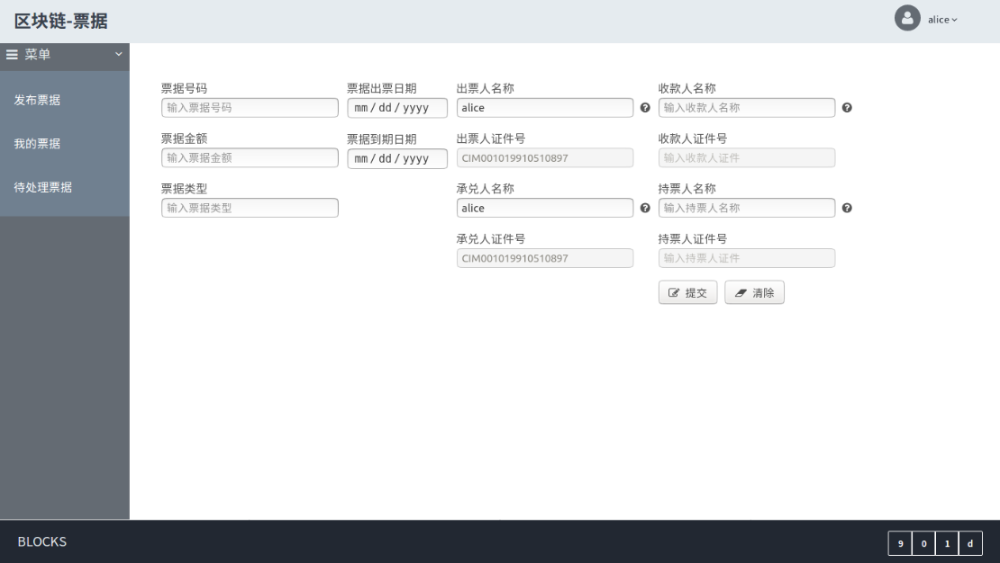

刚进入主界面是发布票据的操作界面，该界面中已经默认填写了出票人名称和承兑人名称，并且出票人证件号以及承兑人证件号会根据出票人名称和承兑人名称进行自动填充了，免去了记忆证件号的麻烦。

出票人名称，承兑人名称，收款人名称，持票人名称左侧提供了本系统的录入的账户名称，鼠标放置在 :question: 就会弹出提示信息，与登录界面相同。
### :one: 票据属性
1. 票据号码 票据的唯一ID，在整个系统中**不可重复**，该ID为19位数字，不足19位会前置'0'补足。
2. 票据金额 票据的面额
3. 票据类型 票据的类別
4. 票据出票日期 票据的出票日期，格式：YYYY-MM-DD
5. 票据到期日期 票据的到期日期，格式：YYYY-MM-DD
6. 出票人名称 出票人的名称
7. 出票人的证件号 出票人的唯一标识，该Demo中该证件号前置'CIM'+15位数字，15位数字暂由出票人名称计算，其后的承兑人证件号，收款人证件号，持票人证件号相同处理。
8. 承兑人名称 承兑人的名称
9. 承兑人证件号 承兑人的唯一标识
10. 收款人名称 收款人的名称
11. 收款人证件号 收款人的唯一标识
12. 持票人名称 持票人的名称
13. 持票人证件号 持票人的唯一标识 
#### 票据状态
票据目前一共有四个状态
```
"NewPublish"： 票据由出票人向持票人新发布票据的状态
"EndrWaitSign"： 票据持有人向被背书人发起背书的状态
"EndrSigned" "EndrWaitSign"状态的票据被被背书人签收的状态
"EndrReject" "EndrWaitSign"状态的票据被被背书人拒绝的状态
```
#### 票据状态流转
票据流转状态如图所示：
只有票据处在NewPublish，EndrSigned，EndrReject状态下才能由持票人进行对票据的背书操作。
```flow
st=>start: Start
op1=>operation: NewPublish
op2=>operation: EndrWaitSign
cond=>condition: accept
op3=>operation: EndrSigned
op4=>operation: EndrReject
st->op1->op2->cond
cond(yes)->op3->op2
cond(no)->op4->op2
```

### :two: 发布票据
发布票据的一般格式（仅供参考）
```
输入票据号码： 12345678901
票据金额： 10000
票据类型： bill
票据出票日期： 2018-09-05
票据到期日期： 2018-09-20
出票人名称： alice
出票人证件号： *自动填充*
承兑人名称： alice
承兑人证件号： *自动填充*
收款人名称： tom
收款人证件号： *自动填充*
持票人名称： tom
持票人证件号： *自动填充*
```
正确填写每一项后，点击提交按钮，等待数秒，会弹出对话框，提示票据发布成功，并会有当前票据号提示。

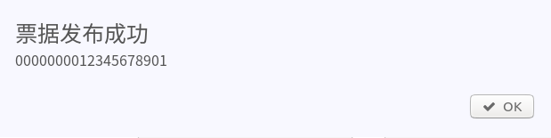

票据发布成功后，会产生新区块，底栏会提示当前区块高度，最右侧的区块为最近发布票据所在的区块高度：


#### *失败*

票据发布失败，同样会弹出对话框，请根据对话框提示检查
- 票据号是否重复，票据号是每一张票据的唯一ID，并且在整个系统中不允许存在重复票据号。
- 出票人名称，承兑名称，收款人名称，持票人名称是否与系统录入的账户名称一致，以及出票人证件号，承兑人证件号，收款人证件号，持票人证件号是否正确填充。
### :three: 更换帐号
为了看到刚才我们发布的票据，我们必须更换帐号：
- 方案一：退出登录，点击右上角当前登录账户名称弹出logout对话气球，点击logout登出，退回登录界面

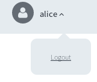
- 方案二: 创建新的标签页，根据你进入系统的方式
    - 如果你选择本地搭建网络，[登录本地页面](localhost:3002/login)
    - 如果你选择在线调试网络，[在线登录页面](http://47.100.238.193:3002/login)
输入正确的账户和密码（发布票据时填写的持票人名称作为UserName）
```
UserName: tom
UserKey: 456789
```
### :four: 查看我的票据
下拉菜单栏，找到我的票据并点击

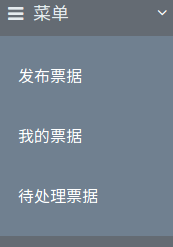

此时主界面将切换到，我的票据列表，这将检索到所有该账户持有到的票据，如图：

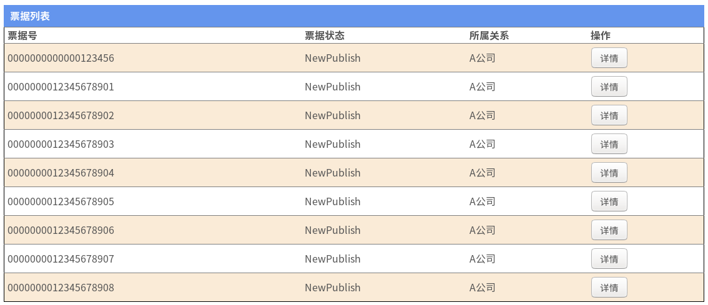

点击任意一个票据的操作目录下的详情按钮，你将能够追溯相应票据号，在整个区块链票据系统中所有的操作。

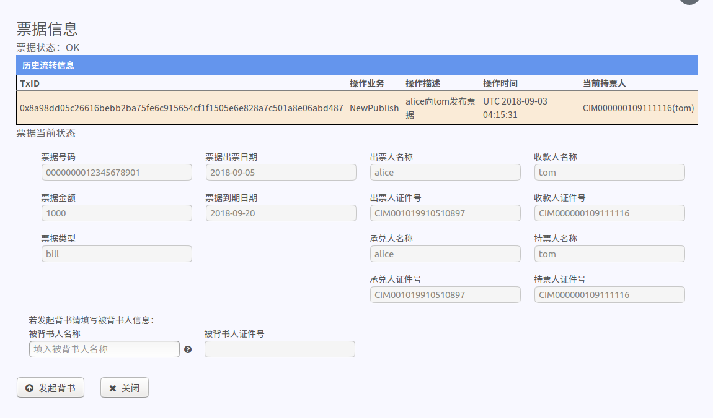

#### 票据流转信息
将看到当前票据在区块链系统所经历的一系列操作：
- TxID: 票据操作所在区块中的TxID
- 操作业务： 票据的操作动作名称，与票据状态相同
- 操作描述： 反映当前票据操作内容
- 操作时间： 票据操作的时间戳，为UTC时间，与CST时间相差8个小时
- 当前持票人： 票据当前的持票人信息，包括名称与ID
#### 票据当前状态
票据当前状态反映了票据当前的全部信息。
#### 发起背书
如果当前登录账户在当前操作票据的实际持票人，同时当前的票据的当前状态非"EndrWaitSign"，那么可以发起背书操作，填写被背书人的名称，同时被背书人的证件号得到正确的填充的情况下，就可以发起背书请求。
```
填入被背书人名称： jack
```
填写正确的被背书人名称以后，点击发起背书按钮。成功发起票据背书的话，等待数秒会弹出一下对话框：

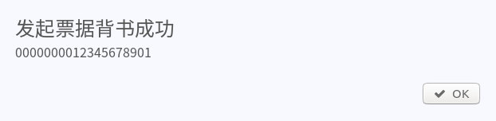

同时底栏的区块高度也会得到更新。


### :five: 处理我的票据
成功发起票据背书请求以后，现在我可以处理背书。根据 :three: 切换帐号，这次我们可以切换到mike账户，根据 :fore: 菜单栏操作并在菜单栏中选择待处理票据，此时会出现如下情况：

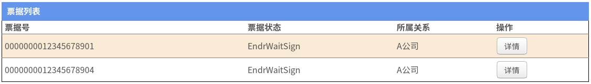

#### 签收票据

在待处理票据菜单下所示票据列表，可以看到票据状态均为"EndrWaitSign"，同样点击详情操作：

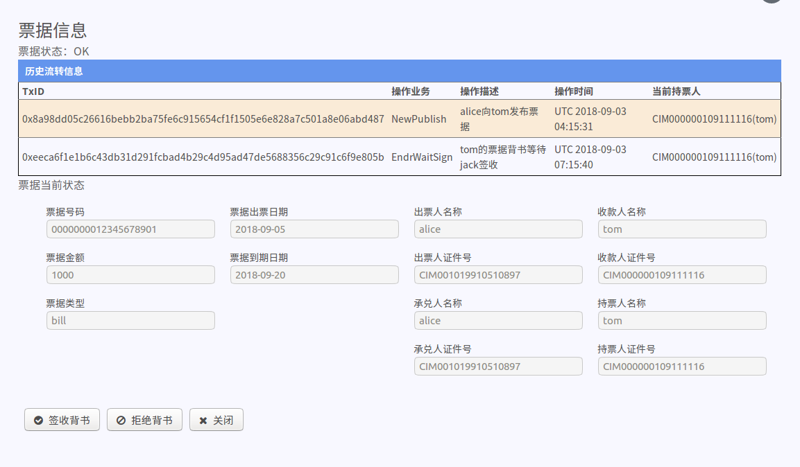

可以看到该票据的流转信息增加了一个“tom向jack发起背书请求，等待jack签收票据”条目。点击右下角的签收背书，将会改变这张票据的持有人“由tom变为jack”，同时tom将无法检索这张票据，票据的状态变为"EndrSigned"。

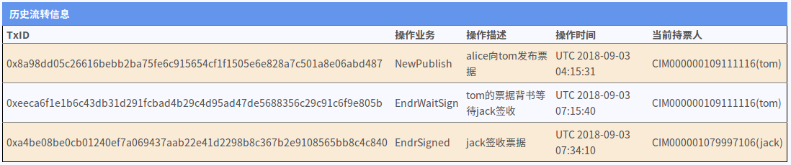

#### 拒绝票据
拒绝票据操作，会使票据状态变为"EndrReject"，持票人不发生变更，同时被背书人将无法查看当前票据：

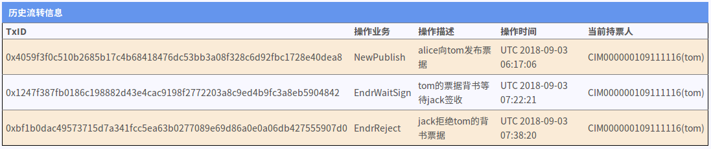

## 3.小结
现在区块链票据系统基本介绍完毕，感谢您阅读本文档到此，同时也宣告了本文档的完结。本系统是我历时1个月时间，一点点从javascript，nodejs，html，css等基本知识，结合了IBM marbles的开源代码，然后从后端到前端一步一个脚印搭建所成，同时也是我第一个互联网开发系统项目。这个项目我会在901d的[git](https://github.com/901d/BillsOnBC_doc)上逐步开源，先release文档，阿里区块链大赛结束之后会将完整代码同样上传到901d上面。