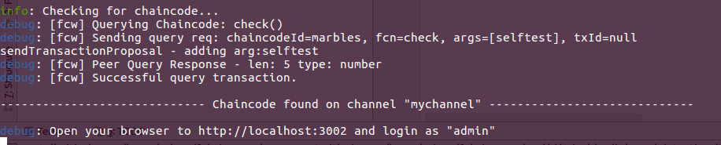

## 1.启动区块链系统
进入根目录：
```
cd BillsOnBC
```
### 安装gulp：
```
npm install -g gulp
npm install
```
整个安装过程未出现error即为安装成功，如果gulp安装过程中提示权限不够的问题，可能你需要设置环境变量`export NPM_CONFIG_PREFIX=$HOME/.npm-global`后再次尝试安装。
### 启动
```
gulp billsonbc
```
如果之前的步骤均未出现问题，您将看到：


恭喜，接下来你将正式进入区块链票据系统，领略一番区块链对票据系统带来的便利、高效与安全。